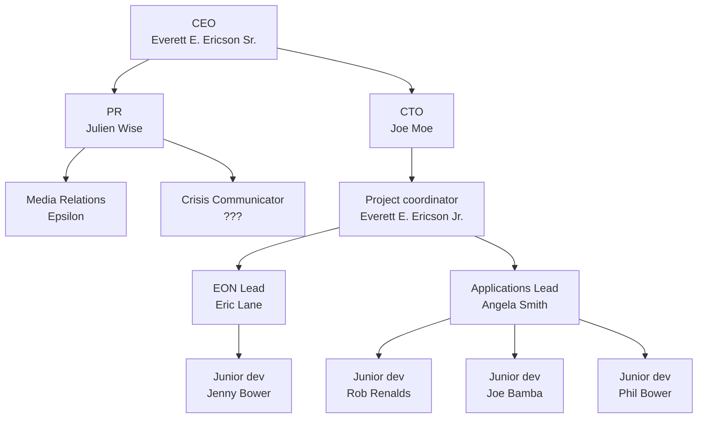
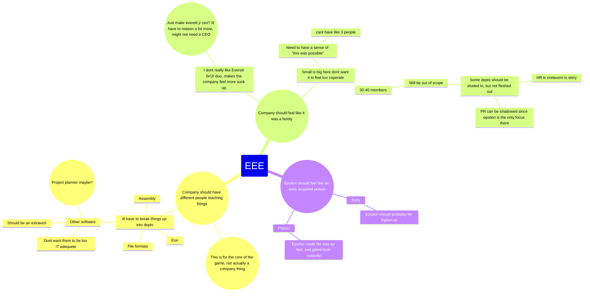

# The EEE org chart

> [!NOTE]
> This is still highly up to change
> Actually actually ATM its completly deprecated, see [characters.md](characters.md) instead

```mermaid
graph TD
EverettE["CEO<br/>Everett E. Ericson Sr."]
CTO["CTO<br/>Joe Moe"]
EricL["EON Lead<br/>Eric Lane"]
Epsilon["Media Relations<br/>Epsilon"]
Crisis["Crisis Communicator<br/>???"]
EverettJr["Project coordinator<br/>Everett E. Ericson Jr."]
JWise["PR<br/>Julien Wise"]
ASmith["Applications Lead<br/>Angela Smith"]
RobR["Junior dev<br/>Rob Renalds"]
JoeB["Junior dev<br/>Joe Bamba"]
PhilB["Junior dev<br/>Phil Bower"]
JennyB["Junior dev<br/>Jenny Bower"]
JennyB["Junior dev<br/>Jenny Bower"]
EverettE --> CTO
EverettE --> JWise
JWise --> Epsilon
JWise --> Crisis
CTO --> EverettJr
EverettJr --> EricL
EverettJr --> ASmith
ASmith --> RobR
ASmith --> JoeB
ASmith --> PhilB
EricL --> JennyB
```

Chaos diagram:

```mermaid
mindmap
    root(<p style="font-size:30pt;">EEE</p>)
        corea((Company should have different people teaching things))
            ((This is for the core of the game, not actually a company thing)
            Ill have to break things up into depts
                Assembly
                Eon
                File formats
                Other software
                    Dont want them to be too IT adequete
                    Should be an extravert
                    ((Project planner maybe?)
        corea((Company should feel like it was a family))
            I dont really like Everett Sr/Jr duo, makes the company feel more suck up.
                ((Just make everett jr ceo? Ill have to reason a bit more, might not need a CEO)
            Small is big here dont want it to feel too coperate
                Need to have a sense of "this was possible"
                    cant have like 3 people
                30-40 members
                    Will be out of scope
                        Some depts should be eluded to, but not fleshed out
                            HR is irrelavent to story
                            PR can be shadowed since epsilon is the only focus there
        coreb((Epsilon should feel like an early acquired poison))
            Early      
                Epsilon should problaby be higher up
            Poison
                Epsilon made his way up fast, and gaind trust instantly
```