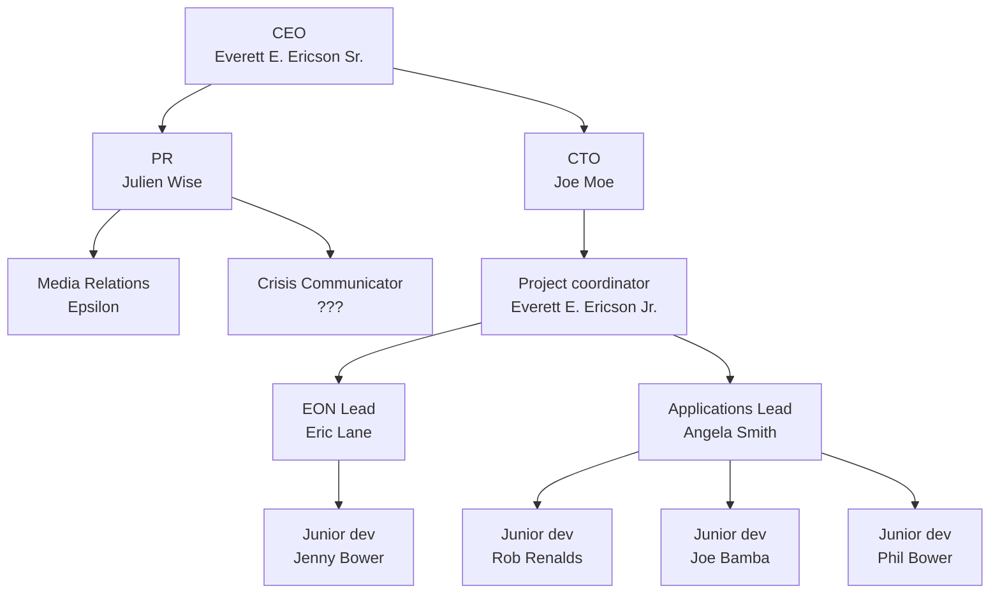

# The EEE org chart

> [!NOTE]
> This is still highly up to change

```mermaid
graph TD
EverettE["CEO<br/>Everett E. Ericson Sr."]
CTO["CTO<br/>Joe Moe"]
EricL["EON Lead<br/>Eric Lane"]
Epsilon["Media Relations<br/>Epsilon"]
Crisis["Crisis Communicator<br/>???"]
EverettJr["Project coordinator<br/>Everett E. Ericson Jr."]
JWise["PR<br/>Julien Wise"]
ASmith["Applications Lead<br/>Angela Smith"]
RobR["Junior dev<br/>Rob Renalds"]
JoeB["Junior dev<br/>Joe Bamba"]
PhilB["Junior dev<br/>Phil Bower"]
JennyB["Junior dev<br/>Jenny Bower"]
JennyB["Junior dev<br/>Jenny Bower"]
EverettE --> CTO
EverettE --> JWise
JWise --> Epsilon
JWise --> Crisis
CTO --> EverettJr
EverettJr --> EricL
EverettJr --> ASmith
ASmith --> RobR
ASmith --> JoeB
ASmith --> PhilB
EricL --> JennyB
```