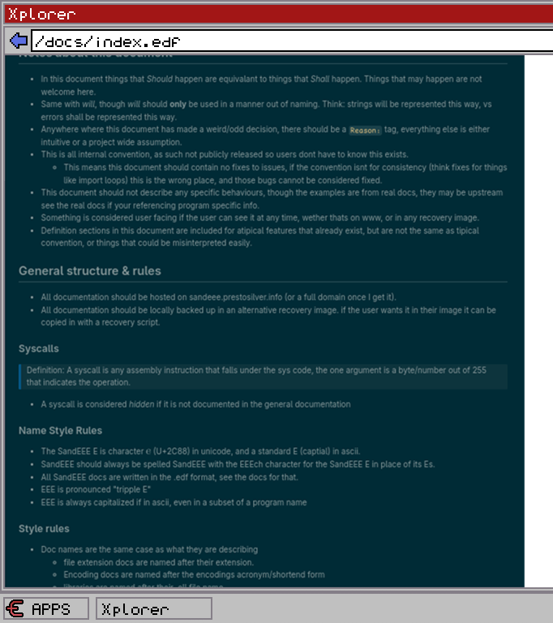

# In defence of metadocumentation
Preston Precourt (prestosilver)

---

# What is SandEEE?

<!--

- Programing game
- High empasis on realism
- Project is already at an mvp

-->

---

# Why?

<div class="columns">
<div>

Documentation for eon
```edf
#Style @/style.eds
:logo: [@/logo.eia]

-- Eon --

    ...

:center: --- EEE Sees all ---
```

</div>
<div>

Documentation for asm
```edf
#Style @../../style.eds
:logo: [@/logo.eia]

-- ASM --

    ...

:center: -- EEE Sees all --
```

</div>
</div>

---

# This is not for everyone 

- SandEEE by nature has user facing documentation
- I am documenting this after I have a full working MVP
- In SandEEE, Bad Docs => Bad Game

---

# Didnt expect to get so much out of this
- Solid framework for what I need
- I know what SandEEE is now

---

# Where to start

- Just start, anywhere works



---

[The docs in question](../plans/meta.md)
# This is my first Marp presentation btw