# SandEEE Lore & Implementation Plan  
*(Consolidated World Timeline + Dev Execution Overview)*  

**THIS IS GPT GENERATED BTW**, I dont have the energy to consolidate ideas quite yet

---

## 🧭 Lore Timeline: The Rise, Fall, and Leak of SandEEE

### **Pre-SandEEE (1990 – 2004): Foundations**
- **EEE (Edenic Engineering Enterprise)** is founded with a mission to *make computing universally accessible* — not profitable.  
- They develop an **internal operating system** used for research and industrial computation.  
  - Known only as “EEE OS” internally.  
  - Built on unique hardware with a *string-efficient* architecture:  
    > “Strings were efficient because the hardware understood them.” 
- The company is viewed as a *corporate joke* — altruistic but unprofitable, a “charity that sells code.” 
- Rival megacorps dismiss EEE’s tech as unscalable fantasy.

---

### **SandEEE Development (2004 – 2005): The Revolution**
- EEE realizes the internal OS could be adapted for consumers.  
- They release **SandEEE OS**, the first “desktop layer” atop their text-based environment.  
  - Designed to be *visually approachable*, with embedded scripting and runtime compilation.  
- SandEEE’s design goal:  
  > “Every user can learn to code, and every line of code should feel like conversation.” 
- It launches with two tiers:
  - **Free Version:** Full OS, no restrictions.  
  - **$5 Source Version:** Includes complete source and compilers — a “paid open source” model.  
- For the first time, EEE turns a profit.  
- Users quickly begin extending SandEEE with *community tools*, which the company loved, and often recognised, even adapting them to be builtin.  
- Among them: **Epsilon**, a solo developer who becomes the most prolific contributor.  
  - His tools push SandEEE into cult-favorite status among hobbyists.

---

### **Sabotage & Collapse (2006 – 2007): The Vanishing**
- EEE is forced into **bankruptcy under opaque circumstances**.  
  - Publicly blamed on “security breaches and inefficiency.” 
  - Privately, insiders suspect corporate sabotage.  
- Key events:
  - **Compiler destruction:** The string-efficient compiler is corrupted beyond recovery.  
  - **Hardware seizure:** All EEE machines are seized or destroyed.  
  - **“EEE Sees All”** slogan, once meant as reassurance (“EEE safeguards all users”), is twisted into a propaganda tool against them.  
- Public records of EEE vanish within a year.  
- SandEEE quietly disappears — websites shutter, mirrors lost.

---

### **Post-Collapse (2008 – 2025): The Leak**
- **Epsilon**, now in obscurity, begins reconstructing the OS from memory and fragments.  
- He builds the **SandEEE Virtual Machine (E-VM)** — a simulated environment attempting to recreate the lost architecture.  
  - The E-VM cannot reproduce the *string-efficient hardware quirk*, only emulate its effects. 
  - This limitation is the **“Impossible Assumption”** — an axiom of computation that no modern system satisfies.  
- Epsilon embeds recovered files, dev notes, and corrupted system emails inside the VM image as *forensic artifacts*.  
- Eventually, he leaks **SandEEE Rebuild (v0.9)** anonymously, claiming it is “a faithful memory.” 
- This leaked build is what players experience.

---

### **Modern Day (2026 – ????): The Player’s Perspective**
- The player runs **Epsilon’s reconstruction** — the “archival image.” 
- They can program, explore, and interact with fragments of the system.  
- Hints of the true story appear in:
  - Locked or partial email archives.  
  - Commented-out source lines.  
  - System utilities referencing missing hardware ops.  
- Subgoal:  
  > “Find the evidence that SandEEE should still exist.” 
- Reality vs. emulation blur — not through magic, but through imperfect digital resurrection.

---

## 🧩 Key Concepts Summary

| Concept | Description |
|----------|-------------|
| **EEE** | Altruistic company; believed tech should belong to everyone. Collapsed under mysterious pressure. |
| **SandEEE OS** | Consumer-friendly desktop built atop EEE’s command system. Released free with open-source option. |
| **Epsilon** | Star community developer → employee → whistleblower → archivist. |
| **String-Efficient Hardware** | EEE’s machine-level anomaly; allowed “impossible” string operations. Sabotaged before replication. |
| **The Impossible Assumption** | The idea that computation could treat strings as fundamental. Modern hardware can’t reproduce it. |
| **E-VM** | Epsilon’s emulator; incomplete recreation of EEE’s hardware and compiler behavior. Introduces quirks/glitches. |
| **EEE Sees All** | Originally a caring motto, later misused as propaganda; now an eerie remnant in the OS. |

---

## 🧱 Implementation Plan (Next Fest-Targeted)

### **A. Narrative / World Integration**
1. **Base VM Layer (Already Present)**  
   - Keep “string” operations and weird runtime quirks consistent with the Impossible Assumption.  
2. **Archived Email System (Reworked)**  
   - Present as *static artifacts* from Epsilon’s bundle, not live communication.  
   - Include partial email chains referencing sabotage and internal morale.  
3. **System Logs & Dev Notes**  
   - Sprinkle “compiler anomaly” mentions through system text and crash logs.  
   - Hint that the player’s runtime is an emulation.  
4. **Epsilon’s Logs / Personal Notes**  
   - Optional discoverables: encrypted or corrupted.  
   - Tone: regretful, methodical, occasionally hopeful.  
5. **“EEE Sees All” Discovery Thread**  
   - Appears multiple times with subtle tonal shifts (comforting → ominous → misused).  

---

### **B. Promotional / Release Alignment**
| Goal | Details | Target |
|------|----------|---------|
| 🎬 **Trailer Production** | “Three Prestons” video call pitch format, all in-engine with CRT filter. | Early 2026 |
| 🎨 **Store Assets** | Hero capsule, banners, icon set, OS desktop mockups, lore hints in background. | Ongoing |
| 🧾 **Steam Page Description** | Adapted, lore-focused rewrite of Itch copy (see current working version). | ASAP |
| 🧩 **Alpha Demo Polish** | Debug Windows threading crash; temporary Safe Mode fallback for stability. | Q4 2025 |
| 📚 **Metadocumentation** | Refresh outdated docs, integrate narrative metadata inline. | Ongoing during work hours |
| 📤 **Next Fest Readiness** | Polished demo build, updated assets, trailer, and description. | June 2026 |

---

### **C. Technical & Narrative Milestones**
| Phase | Focus | Deliverables |
|--------|--------|--------------|
| 🧩 **Core Stability** | Fix threading crash; enable safe debug mode. | Stable cross-platform build |
| 🖼️ **Lore Integration** | Implement static emails, logs, and discovery hooks. | Playable discovery loop |
| 🎥 **Trailer Creation** | Record “Three Prestons” footage via in-game VM. | Steam trailer |
| 🎨 **Art & Capsule Work** | Capsule art, banners, and thumbnails; lore references. | Steam branding kit |
| 🗂️ **Documentation Rework** | Replace or merge stale docs with meta-docs. | Updated repo docs |
| 🚀 **Next Fest Launch** | Publish demo, announce EEE restoration project. | Steam Next Fest (2026) |

---

## ⚙️ Recommended Next Steps
1. **Steam Page Setup**
   - Finalize description and initial screenshots early.
2. **Begin Trailer Recording Tests**
   - Mock up a short call segment with CRT filter.
3. **Windows Crash Debug**
   - Use Safe Mode to reproduce under consistent conditions.
4. **Metadoc Overhaul**
   - Review existing docs, mark stale ones for rewrite.
5. **World Bible Expansion**
   - Continue fleshing out pre-SandEEE and Epsilon-era notes for hidden game files.

---

> *“EEE saw everything — not to control, but to care.  
>  And maybe that’s why they were erased.”*

---

## 🧩 SandEEE World Relationship Diagram (Mermaid)

```mermaid
graph TD
    %% Player Layer
    A["🧑‍💻 Player<br/>(Running SandEEE Leak)"] --> B["Epsilon's VM (E-VM)<br/><i>Rebuild of Lost Hardware</i>"]

    %% VM Layer
    B --> C["💻 SandEEE OS (2005)<br/><i>First consumer desktop by EEE</i>"]

    %% OS Layer
    C --> D["🏢 EEE Corporation<br/><i>Altruistic creators — “Everyone can code”</i>"]
    
    %% EEE Layer
    D --> E["⚙️ Unnamed Megacorp<br/><i>Sabotaged and erased EEE’s legacy</i>"]

    %% Styling and Relationships
    style A fill:#333,stroke:#666,color:#fff
    style B fill:#222,stroke:#555,color:#fff
    style C fill:#111,stroke:#444,color:#fff
    style D fill:#000,stroke:#333,color:#0f0
    style E fill:#000,stroke:#333,color:#f55

    %% Extra Notes
    B -.-> Cnote["VM quirks mirror lost EEE hardware<br/>– 'Impossible assumption' in string handling"]
    D -.-> Enote["EEE destroyed by unnamed rival<br/>who rewrote computing history"]
    Epsilon["🧠 Epsilon<br/><i>Leaked SandEEE to clear EEE’s name</i>"] --> B
    style Epsilon fill:#222,stroke:#555,color:#0af
```

